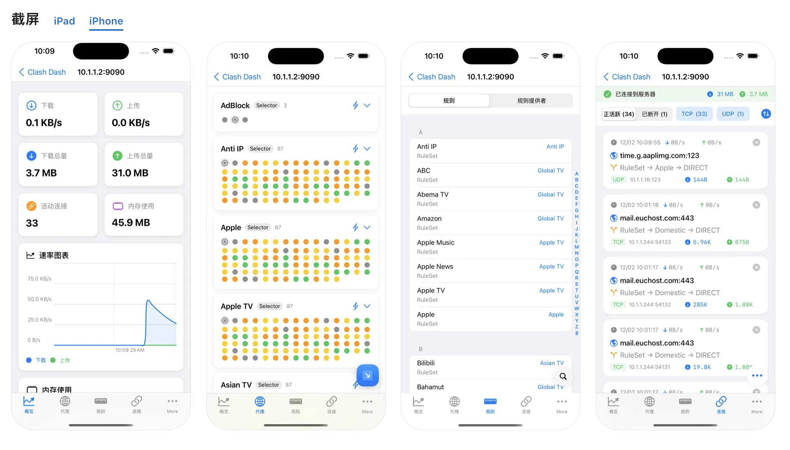

# Clash Dash

Clash Dash 是一款原生 SwiftUI 开发的 OpenClash 管理工具。

## 预览

## 主要功能

- 便捷管理多个 Clash 服务器
- 实时监控服务器状态和性能
- 可视化流量统计和速率图表
- 灵活配置代理规则和策略组
- 支持自定义测速地址
- 一键测试全部节点延迟

## 隐私声明

Clash Dash **不会收集任何用户数据**。具体来说：

- 不收集任何个人信息
- 不追踪用户行为
- 不上传任何使用数据
- 所有数据都存储在用户设备本地
- 没有内置分析或跟踪代码
- 不与任何第三方共享数据

## 技术特点

- 原生 SwiftUI 开发
- 完美支持 iOS 系统
- 完全开源，代码透明

## 贡献

欢迎提交 Issue 和 Pull Request！ 